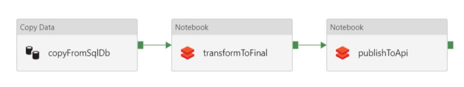
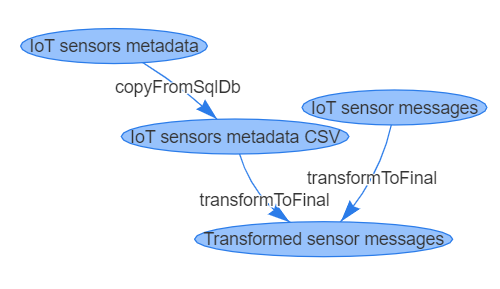

# azure-data-manager

## Table of contents

- [Introduction](#introduction)
- [Architecture](#architecture)
- [Getting Started](#getting-started)
  * [Configuration](#configuration)
  * [Security](#security)
  * [Deployment](#deployment)
  * [Testing APIs locally](#testing-apis-locally)
- [TODO](#todo)
- [Team](#team)

## Introduction

Organizations which produce large volumes of data are increasingly investing in exploring better ways to discover, analyze and extract key insights from the data. These organizations face regular challenges in the shape of *data ponds* and often struggle to make the right dataset available to their primary users i.e. Data Analysts/Data Scientists.

This project aims to provide a template for defining, ingesting, transforming, analyzing and showcasing data using Azure Data platform. We've leveraged Azure Cosmos DB SQL API as storage layer for data catalog. Azure Blob Storage serves as the defacto store for all semi-structured data (e.g. JSON, CSV, Parquet files). Azure Data Factory (ADF) v2 performs the orchestration duties with Azure Databricks providing the compute for all [transformations](https://docs.microsoft.com/en-us/azure/data-factory/transform-data-using-databricks-notebook). 

The front-end interface is an ASP.NET Core web app which reads catalog definitions and creates ADF entities using the [ADF .NET Core SDK](https://docs.microsoft.com/en-us/azure/data-factory/quickstart-create-data-factory-dot-net). For visualizing data lineage, [vis.js networks](http://visjs.org/network_examples.html) were used.

## Architecture

## Getting Started

In this solution our [catalog definition](DataManager.Web/SampleData) consists of 2 data sources;

a) Time Series JSON files from IoT sensors

b) SQL Database Table containing sensors metadata

Our data pipeline simply extracts the metadata from SQL Database into tabular form, joins it with time series data and finally publishes it to a REST endpoint.

*ADF pipeline view*

*Web app data lineage view*

The pipeline can either be triggered manually using the web app's REST API or in case of *dynamic* data sources i.e. Time Series, an [event trigger](https://docs.microsoft.com/en-us/azure/data-factory/how-to-create-event-trigger) is automatically created.
>Event triggers unfortunately have [performance limitations](https://github.com/MicrosoftDocs/azure-docs/issues/15909) hence creating more than 100 dynamic data sources is currently not supported.

### Configuration

For configuring the ASP.NET Core web app [please follow this document](docs/configuration.md).

### Security

To authenticate the web app we create an [Azure AD application](https://github.com/Azure-Samples/active-directory-aspnetcore-webapp-openidconnect-v2/). This application also has to be [assigned contributor role](https://docs.microsoft.com/en-us/azure/data-factory/quickstart-create-data-factory-dot-net#create-an-application-in-azure-active-directory) on the resource group so that ADF and its entities can be provisioned.

In order to access credentials of our data sources, ADF relies on Azure Key Vault. When an ADF resource is provisioned in Azure, a [Service Identity](https://docs.microsoft.com/en-us/azure/data-factory/data-factory-service-identity#retrieve-service-identity) is automatically generated. That Service Identity has to be granted `Get` permission in the [Key Vault access policies](https://docs.microsoft.com/en-us/azure/data-factory/store-credentials-in-key-vault#steps).

### Deployment

[Please follow this document](docs/deployment.md) for deployment to Azure.

### Testing APIs locally

## TODO

- Leverage ADF [Data Flow](https://github.com/kromerm/adfdataflowdocs) for common transforms.
- Use Azure Data Lake Store [Gen2](https://docs.microsoft.com/en-us/azure/storage/data-lake-storage/introduction) as the underlying storage layer.

## Team

[Matthieu Lefebvre](https://www.linkedin.com/in/matthieu-lefebvre-92166728/)

[Sofiane Yahiaoui](https://www.linkedin.com/in/sofiane-yahiaoui-7006b915/)

[Igor Pagliai](https://github.com/igorpag)

[Engin Polat](https://github.com/polatengin)

[Christopher Harrison](https://github.com/GeekTrainer)

[Syed Hassaan Ahmed](https://twitter.com/hasssaaannn)