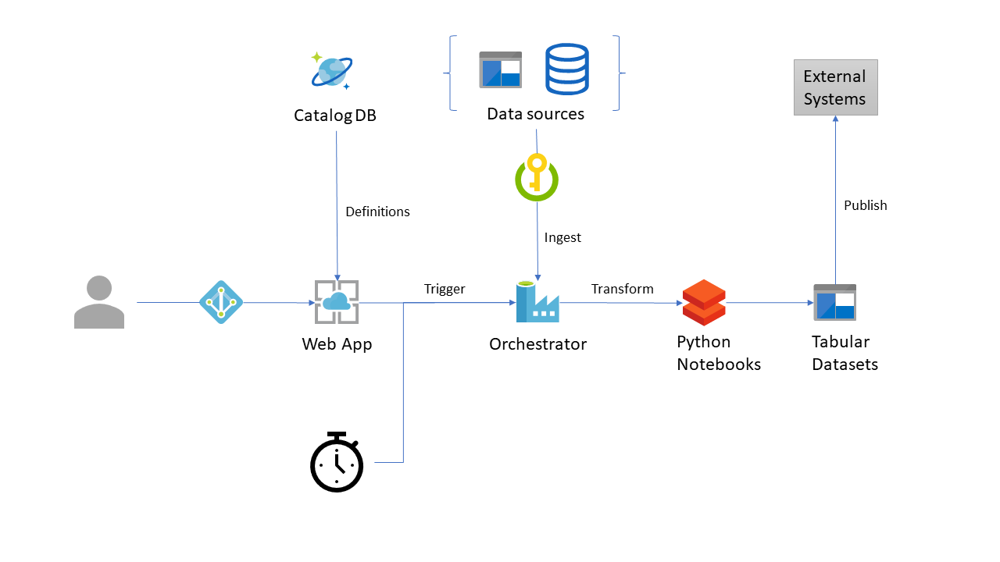

# azure-data-manager

## Introduction

Organizations which produce large volumes of data are increasingly investing in exploring better ways to analyze and extract key insights from this data. These organizations often face the challenge of diving into _data ponds_ and making the right dataset available to the prime beneficiaries i.e. Data Analysts/Data Scientists.

This project aims to provide a template for exploring, ingesting, transforming, analyzing and showcasing data using Azure Data platform. We've used Azure Cosmos DB as the storage for data catalog. Azure Data Factory v2 performs the orchestration duties with Azure Databricks providing the compute for all transformation. The front-end interface of this project is an ASP.NET Core application.

## Architecture

## Getting Started

## TODO

- Leverage Azure Data Factory [Data Flow](https://github.com/kromerm/adfdataflowdocs) for common transforms.
- Use Azure Data Lake Store [Gen2](https://docs.microsoft.com/en-us/azure/storage/data-lake-storage/introduction) as the underlying storage layer.

## Team

[Matthieu Lefebvre](https://www.linkedin.com/in/matthieu-lefebvre-92166728/)

[Sofiane Yahiaoui](https://www.linkedin.com/in/sofiane-yahiaoui-7006b915/)

[Igor Pagliai](https://github.com/igorpag)

[Engin Polat](https://github.com/polatengin)

[Christopher Harrison](https://github.com/GeekTrainer)

[Syed Hassaan Ahmed](https://twitter.com/hasssaaannn)